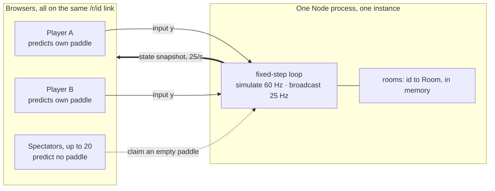
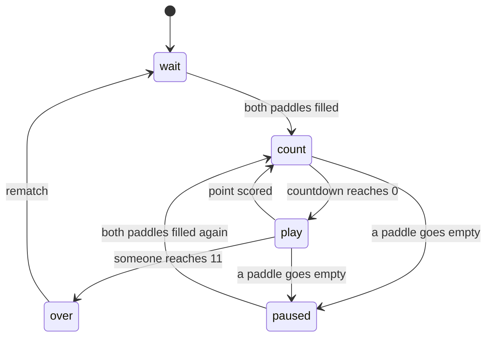
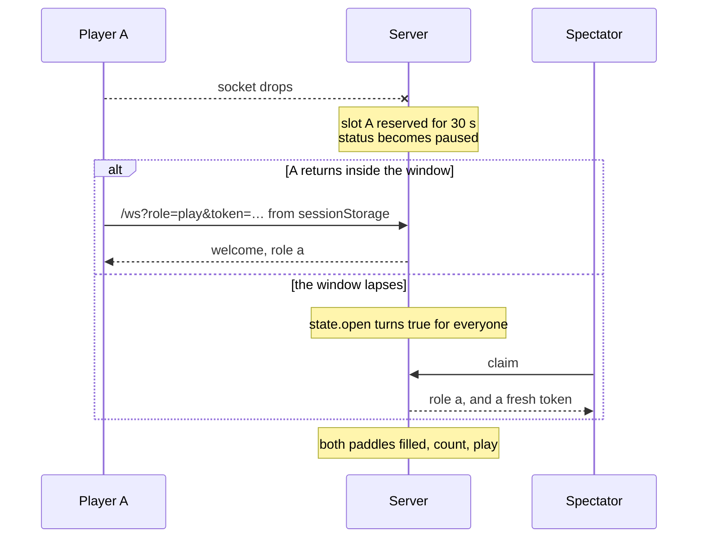
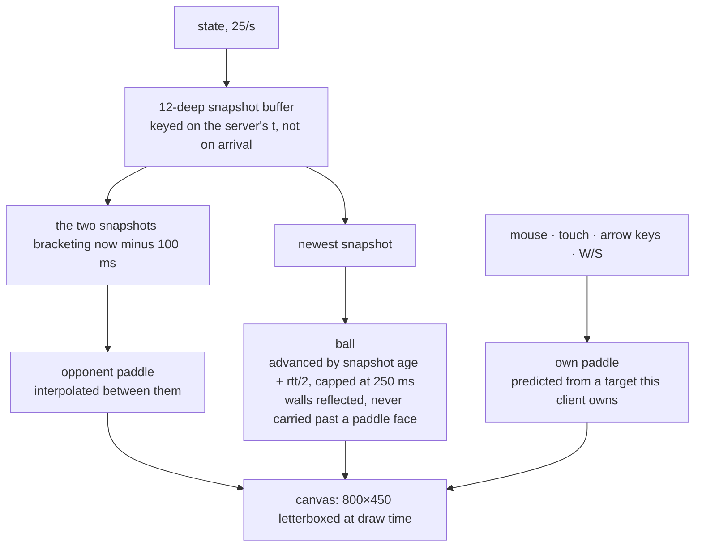
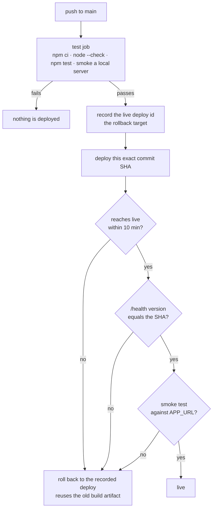

<p align="center">
  
</p>

<p align="center">
  <a href="https://github.com/assokhi/tetris/actions/workflows/deploy.yml"></a>
  
  
  <a href="LICENSE"></a>
</p>

# Pong — two players, many spectators

Server-authoritative Pong over WebSockets. The server owns the ball, the paddles
and the score, simulates at a fixed 60 Hz in an 800×450 virtual space, and
broadcasts snapshots at 25 Hz. Clients send a target paddle y and render an
interpolated view of what they receive.



| file | what is in it |
| --- | --- |
| [server.js](server.js) | HTTP, WebSocket, room registry, simulation, and the `--selftest` physics check |
| [client.html](client.html) | the entire client: WebGL2 renderer, DOM HUD, input, prediction, reconnect |
| [scripts/checkclient.mjs](scripts/checkclient.mjs) | parses the page and reads the shader as pedantically as a compiler would, since CI has no GPU |
| [scripts/smoke.mjs](scripts/smoke.mjs) | end-to-end check against a running server |
| [scripts/netmath.mjs](scripts/netmath.mjs) | lifts the client's net math out of `client.html` so tests drive the shipped code, and replays a captured session through it |
| [scripts/predict.test.mjs](scripts/predict.test.mjs) | interpolation, clock slew and ball smoothness against built fixtures |
| [scripts/netshape.mjs](scripts/netshape.mjs) | TCP impairment proxy: latency, jitter, and the stalls that loss really causes |
| [scripts/impaired.mjs](scripts/impaired.mjs) | a real game played through that proxy, asserted on two clocks at once |
| [render.yaml](render.yaml) · [deploy.yml](.github/workflows/deploy.yml) | host definition and the deploy-with-rollback pipeline |

## Run it

```
npm install          # one dependency: ws
npm start            # http://localhost:8080   (PORT=... to change)
npm run check:client # client.html parses, its ids exist, its shader is well formed
npm test             # physics: tunneling, angle reflection, walls, scoring, fairness, determinism
npm run test:predict # the client's interpolation and extrapolation, lifted out of client.html
npm run test:impaired# a real game over a link with 150 ms latency, jitter and 3% loss
npm run smoke        # end-to-end against a running server (pass a base URL to target another host)
```

To play over a bad link by hand, put the impairment proxy in front of the server
and use its port instead:

```
npm start &
DELAY_MS=150 JITTER_MS=50 LOSS=0.03 npm run netshape   # then play on :9080, not :8080
```

`?buffer=250` and `?rtt=200` on a room URL pin the interpolation delay and the
extrapolation distance, so you can see what a given latency looks like without
having it. In a room, **press F** to send a note along with that session's own
network and smoothness measurements — see [Beta telemetry](#beta-telemetry).

`npm run smoke` needs no environment setup and no waiting: it asks `POST /room`
for its own short reconnect and sweep windows, so every assertion — including
the spectator claim after a lapsed reservation, and the room sweep — runs
against any server, production included. `PONG_RESERVE_MS` and
`PONG_EMPTY_TTL_MS` only change the *defaults* for rooms that don't ask.

| env | default | what it changes |
| --- | --- | --- |
| `PORT` | 8080 | listen port |
| `PONG_RESERVE_MS` | 30 s | default slot reservation after a player drops |
| `PONG_EMPTY_TTL_MS` | 10 min | default no-player room TTL |
| `PONG_SNAP_MS` | 40 | snapshot period — bandwidth against smoothness |
| `PONG_BEAT_MS` | 5 s | keepalive period, and how often RTT is resampled |
| `PONG_METRICS_TOKEN` | unset | turns `GET /metrics` on; unset means it 404s |

Open <http://localhost:8080>, click **Create room**, and share the `/r/<id>` URL.
Everyone uses the same link: the first two openers can choose **Play**, everyone
after that watches (up to 20) and can take over a paddle that goes empty.

Controls (players only): mouse, touch, arrow keys, or W/S.

## Rules and lifecycle

- First to 11. Either player can hit **Rematch**; the score resets and spectators stay.
- Serve is 1.5 s after each point, aimed away from whoever conceded.
- Paddle bounce is offset-based: where you hit the paddle sets the exit angle
  (up to 60°) and the ball speeds up 5% per hit, capped.

A room holds one status, and the second player arriving is what starts anything:



`over` is the one status a dropped player cannot interrupt: the game is decided,
so the server leaves it alone until someone asks for a rematch.

### When a player drops

Their slot is held for 30 s and the game pauses rather than ending. Whichever
comes first — the original player returning with their token, or the window
lapsing and a spectator claiming the seat — play resumes as soon as both paddles
are occupied again.



- Every socket is pinged every 5 s and terminated if it misses a whole beat.
  A client that disappears without closing — lid shut, tunnel dropped, carrier
  handover — is otherwise still holding its paddle when the OS gives up on the
  TCP connection *minutes* later, and for that whole window the room never
  pauses, the opponent farms free points into an empty net, and the slot never
  reaches the reservation that would let a spectator take it. Ping and pong are
  protocol-level frames, so the browser answers them with no client code; the
  same pong is what times the round trip.
- Rooms are in-memory, swept every 5 s: dropped once everyone who was in them has
  left, or after 10 minutes with no player in either slot. A room with spectators
  but no player survives until that second timeout.
- A room nobody has connected to yet is exempt from the first rule for 60 s. Its
  creator's browser is still loading `/r/<id>`, and on a slow connection that
  outlasts a sweep tick — sweeping it there hands them a dead link to the room
  they just made.
- Both windows are per room: `POST /room` may shorten them (see below), which is
  how the smoke test covers the claim and sweep paths in seconds instead of
  minutes. This is deliberately unauthenticated — the worst anyone can do is make
  their *own* room forget them faster.

## HTTP

| Method | Path | Response |
| --- | --- | --- |
| `POST` | `/room` | `{id, reserveMs, emptyMs, seed}`, room created. Optional JSON body `{reserveMs, emptyMs, seed}` overrides that room's disconnect reservation (500 ms – 60 s), its no-player TTL (1 s – 10 min), and the serve PRNG seed; out-of-range and junk values fall back to the defaults, and the body is capped at 1 KB. The response echoes the values actually used. A seed decides nothing but which way the ball is thrown, so there is nothing to gain by choosing one — it exists so a test can replay a game exactly |
| `GET` | `/health` | `{ok, version, rooms, uptime}` — `version` is `RENDER_GIT_COMMIT` or `dev`. CI polls it to confirm the new process is serving traffic before smoke-testing it |
| `GET` | `/metrics?token=…` | The last 200 beta telemetry reports. **404 unless `PONG_METRICS_TOKEN` is set and matches** — these records carry players' free-text notes, so the default is that the endpoint does not exist. Compared by digest, not by string, so a wrong token leaks nothing including its length |
| `GET` | `/` | landing page (create / join by id) |
| `GET` | `/r/:id` | the same `client.html` |
| `GET` | `/ws?room=<id>&role=play\|watch&token=<t>` | WebSocket upgrade; `token` is optional and only used to reclaim a reserved slot |

## Message protocol

All frames are JSON with a `type` field.

### Client → server

| type | payload | who may send | server behaviour |
| --- | --- | --- | --- |
| `input` | `{y: number}` — target paddle y in virtual units | player A or B only | `y` is clamped to `[40, 410]` and **ignored** unless the room's own record says this socket holds that slot. A claimed role in a message is never trusted. Send at ≤ 60/s. |
| `claim` | `{}` | any socket without a slot | seats it in a free, unreserved slot and replies with `role`; ignored if no slot is claimable |
| `rematch` | `{}` | player A or B only | only while `status === "over"`: resets the score, keeps the room and its spectators |
| `telemetry` | `{ms, net{}, render{}, view{}, note?}` — a beta session's own measurements, and optionally a note the player typed | any socket, at most every 5 s | rebuilt from a whitelist before it is logged: unknown keys dropped, numbers coerced and clamped to `[0, 1e7]`, `note` truncated to 500 chars. Room, role, timestamp and user agent are attached by the server and cannot be set by the client |

Malformed JSON, unknown types, and non-finite `y` are dropped silently.

### Server → client

| type | payload | sent to |
| --- | --- | --- |
| `welcome` | `{room, role: "a"\|"b"\|null, token: string\|null, dims:{W,H,R,PW,PH,AX,BX,SPEED,WIN}}` | once on connect. `role: null` means spectator; `token` reclaims the slot within the 30 s reservation |
| `state` | `{ball:{x,y,vx,vy}, paddles:{a,b}, score:{a,b}, spectators:int, open:bool, status, cd, winner, t}` | everyone in the room, 25 Hz, serialized once per room per tick. **`t` is the simulation clock, not the wall clock** — the instant the contents are from, advanced by exactly one step per step. Clients extrapolate from it, so stamping it at broadcast instead puts the error straight onto the ball |
| `role` | `{role:"a"\|"b", token}` | the socket whose `claim` succeeded; it switches to player mode |
| `lag` | `{ms}` — smoothed round trip, measured server-side | a player, once per keepalive beat, in reply to its `pong` |
| `bye` | `{code, reason}` | any socket the server is about to close, sent ~250 ms before the close frame. Proxies (Render's included) may swallow a close frame and leave the peer with a bare `1006` and no reason, so the reason travels as ordinary data and the close code is only a fallback. Clients and the smoke test key off this message |

`status` is one of `wait` (no second player yet), `count` (serving, `cd` seconds
left), `play`, `paused` (a player dropped), `over` (`winner` is `"a"`/`"b"`).
`open` is true when a paddle is free *and* out of its reservation window — the
client uses it for both the Play/Watch choice and the "take the empty paddle"
button. `t` is the server's send time.

### Close codes

| code | reason |
| --- | --- |
| `4001` | `both paddles are taken` — the client reconnects as a spectator |
| `4002` | `spectator limit reached` (cap 20) |
| `4003` | `room closed` (TTL sweep) |
| `4004` | `server restarting` (SIGTERM) — the client says so instead of showing a generic disconnect |

Each of these arrives first as a `bye` message and then as the close code. Do not
depend on the close code alone: a proxy that drops the close frame turns every one
of them into `1006`, and a client reading only the code would treat "room full" as
a network blip and retry in a loop.

## What is drawn when

Nothing is drawn from a raw snapshot position, and not everything is drawn from
the same moment in time.



**Paddles run 100 ms late.** They are interpolated between the two buffered
snapshots that bracket that moment, which is what keeps an opponent's motion
smooth across a lossy link.

**That 100 ms is measured on the server's clock, never on arrival time**, and on
a bad link the difference is the whole ball game. This is TCP: a lost segment is
not a gap, it is a stall, because every byte queued behind it waits for the
retransmit. Then the backlog lands at once. Keyed on arrival, a burst of five
snapshots got five near-identical timestamps, the search for the bracketing pair
walked back to the oldest frame still buffered, and the opponent's paddle lurched
*backwards* a sixth of a second before fast-forwarding through the burst —
measurably 164 ms of lurch against 10 ms once the same fixture is played on `t`
(`scripts/predict.test.mjs`, which keeps the old algorithm as a control so the
fixture cannot quietly stop proving anything). Snapshots are 40 ms apart on `t`
however the bytes actually turn up, so the burst plays out at its real speed and
the buffer absorbs the stall.

Client and server clocks are related by an offset taken as the minimum of
(local − server) over a sliding window: the least-delayed sample in recent memory
spent the least time in transit, so it is the closest look at the true offset. A
window rather than an all-time minimum, because an all-time minimum is pinned
forever by one lucky early packet and can never follow a server clock that moves.

**That offset is never applied as a jump, and neither is the round trip.** Both
are revisions to where the entire extrapolated world sits, so a step in either
teleports the ball — at 900 px/s a 40 ms revision moves it 18 px in one frame.
They are bled in at 15 ms/s instead, which costs a 1.5% velocity error no eye can
catch and still closes a 100 ms correction in under seven seconds. The first
measurement of each is adopted outright; there is nothing to be smooth relative
to yet, and starting five seconds behind is worse than starting exactly right.

**The ball does not.** Between bounces it travels in a straight line, so where it
is *now* follows exactly from the newest snapshot. Drawing it in the past let the
server award a point while the ball still looked a tenth of the field short of
the paddle — the player saw a shot they could still reach, and lost it anyway. So
it is advanced from the newest snapshot by that snapshot's staleness plus half the
round trip, and reflected off the top and bottom walls, which are predictable.
Contact with a paddle is not predictable and is the server's call, so the
extrapolated ball is never carried past a paddle face the server has not yet
ruled on.

**Only the staleness is capped, at 250 ms — not the sum.** These are different
quantities and only one of them is a risk: half the round trip is a standing,
measured correction that is always right to apply, while staleness is what runs
away when a connection dies. Capping the sum looks equivalent and is not. On any
link past about 300 ms RTT the ceiling binds permanently, the extrapolation stops
responding to time at all, and the ball advances only when a snapshot lands —
stepping ~16 px at 21 Hz. That is *worse* jitter than the cap was added to
prevent, and it appears only on exactly the slow links that need help most.

The round trip has to be measured, and it is measured entirely server-side: the
keepalive ping is stamped on the way out, the clock is read again when the `pong`
comes back, and the smoothed result goes to the player as `lag`. Nothing a client
says enters it. It is smoothed because a jumpy value would make the rendered ball
jitter, and RTT is a slow-moving quantity anyway. A spectator gets a `lag` of
zero and advances the ball by the snapshot's age alone.

Note what this does *not* buy. Because every snapshot carries `vx, vy`, any
client can already integrate the ball's whole path to its own paddle plane
without asking the server anything, so a modified client that inflates its own
extrapolation is not being stopped by this number — it was never being stopped.
The only real counter is to stop shipping velocity, which costs exactly the
reachability the extrapolation was added to restore. In a link-shared game with
no ranking, that is the wrong trade; server-side measurement is here because it
is simpler and has no junk-input surface, not because it is a defence.

**A player's own paddle is predicted locally and never corrected mid-motion.** A
snapshot describes the paddle as it was a round trip ago, so while the player is
gliding it, being ahead of the server by speed × latency is correct prediction,
not error — nudging the rendered paddle toward that stale sample is what makes a
glide stutter, badly enough to snap backwards ~70 units per snapshot at 100 ms.
Position cannot be corrected here either: the paddle's position is a pure
function of a target this client owns, so the next frame's prediction pulls any
nudge straight back. So reconciliation instead waits until the paddle is settled
(target reached and unchanged for 150 ms) and, if the server is still working
from a different target — an input lost with a dying socket — re-sends the
target, at most twice a second, and lets the server's own simulation close the
gap.

### Reconnecting

An unexpected drop — the common case on mobile — reconnects automatically:
roughly 250 ms, 500 ms, 1 s, 2 s, 4 s, then capped at 5 s, each jittered ±20%,
for about 30 s, showing "reconnecting…" with the attempt count. A player reuses
the `sessionStorage` token and lands back in their own slot; a spectator just
rejoins. After 30 s it stops and offers a manual button.

Deliberate closes never enter that loop: `4001` falls straight back to watching,
`4002` and `4003` show the reason with a manual button, and `4004` says the
server is restarting and enables its button after 8 s, since the replacement
instance needs time to boot. Which case it is comes from the `bye` message when
there is one, falling back to the close code, so a proxy that eats close frames
cannot turn a deliberate refusal into a retry loop.

## Graphics

The playfield is WebGL2: one fullscreen triangle, and every shape in it a signed distance field
evaluated in the fragment shader. Not for throughput — the 2D path it replaced issued about
twenty-three draw calls a frame into a GPU-accelerated context and was never anywhere near being
the bottleneck. It is for the glow. Neon needs a halo around every shape, and in Canvas2D that
means `shadowBlur`, a real gaussian run per shape per frame, which *is* slow enough to notice.
Against an SDF the same halo is `k / (k + d*d)` — one divide. The effect that would have cost the
most is the one that comes free.

What that buys, in about seventy lines of GLSL: cyan and magenta paddles with rounded caps, a
ball drawn as a capsule swept along its own velocity so speed reads as a streak, a flash on each
paddle when the server flips the ball's `vx`, a lit field boundary, dashed centre line, vignette
and faint scanlines, all tone-mapped so the glow saturates instead of clipping.

Geometry arrives as uniforms rather than baked into the shader, because `welcome` carries the
server's dims and the client is supposed to honour whatever it is told.

**No text is drawn on the canvas.** The score, countdown and labels are DOM, positioned over the
letterboxed field by `resize()` and sized in `em` so they scale with it. They are crisper at any
device pixel ratio, restyleable without touching a shader, and they are updated only when a value
changes rather than every frame — which also drops four `fillText` calls and two `ctx.font`
assignments out of the frame. `ctx.font` was the single most expensive call in the old loop, so
the one honest performance win here came from moving text *out* of the renderer, not into it.

A canvas keeps whichever context it first hands out, so `webgl2` is requested exactly once and
`2d` is taken only if that came back null. The fallback draws the same shapes flat, without the
glow it is standing in for. Context loss is handled: the program is dropped and rebuilt on
restore.

### The shader is the one thing no test runs

There is no GPU in CI and no browser in the test suite, so `npm run check:client` reads the
shader the way a compiler would instead. It checks that `#version 300 es` opens each unit (a
leading newline is a hard error in GLSL ES), that braces and parens balance, that no `float` is
assigned a bare int (there is no implicit conversion), that the fragment shader declares a
precision and an `out vec4`, and that the uniform names the JS looks up, the ones it writes, and
the ones the shaders declare are all the same set — a uniform that exists on only one side
resolves to null and every write to it becomes a silent no-op.

## Beta telemetry

"The ball is jittery" is not a thing a log can hold, so the client measures it
instead. Every frame in which the ball is in free flight — no bounce, no paddle
clamp, no capped staleness — it compares where the ball was drawn against where
velocity × frame time says it should have been. On a correct stream that
difference is ~0 whatever the network is doing, so **any non-zero value is a real
defect, and the network numbers reported beside it say which one.**

| field | meaning |
| --- | --- |
| `render.jitMed` / `jitP95` / `jitMax` | that departure, in virtual px per frame. Sub-pixel is healthy; ~5 px means snapshots are mis-stamped, ~16 px means the extrapolation is pinned at its ceiling |
| `render.underruns` | frames where the buffer had nothing left to interpolate toward |
| `render.clamped` | frames excluded from the jitter figure, i.e. spent on a bounce, a paddle face, or a capped staleness |
| `render.ageMax` | furthest the ball was extrapolated, ms |
| `net.gapMed` / `gapP95` / `gapMax` | snapshot inter-arrival, ms. A p95 far above the median is a bursty link |
| `net.stalls` | arrival gaps over 200 ms — retransmit-sized holes in a 40 ms stream |
| `net.rtt`, `net.snaps`, `net.reconnects` | round trip, snapshots received, socket drops |
| `note` | free text, only ever present when a player pressed **F** and typed something |

Reports go out every 15 s and whenever a player sends feedback. Each one lands as
a single `telemetry {…}` JSON line on stdout — which the host captures, so no
pipeline is needed to read them — and into a 200-entry ring served by
`GET /metrics?token=…`. Set `PONG_METRICS_TOKEN` to turn that endpoint on; it
holds players' own words, so with no token set it 404s like any other unknown
path.

```
curl -s "$APP_URL/metrics?token=$PONG_METRICS_TOKEN" | jq '.reports[-5:]'
```

Everything in a report crosses a trust boundary on its way into that log, so none
of it is copied verbatim: the record is rebuilt from a whitelist, numbers coerced
and clamped, the note truncated, and room, role, timestamp and user agent
attached server-side where a client cannot reach them.

## Testing

Five layers, each asserting the thing it is actually able to observe. The split
matters more than the count: put a claim in the wrong layer and you get a test
that is either flaky or vacuous.

| Layer | Command | What only it can prove |
| --- | --- | --- |
| Page and shader | `npm run check:client` | That the page parses at all, that every id the script reaches for exists, and that the shader is structurally sound — the only code here no test executes |
| Physics | `npm test` | Exact, in-process, no timers: tunneling, reflection, walls, scoring, the fairness invariant, and identical replay from a seed |
| Client net math | `npm run test:predict` | Interpolation, clock tracking, slew bounds and ball smoothness, against hand-built burst and mis-stamp fixtures no live run can reproduce on demand |
| Degraded network | `npm run test:impaired` | That a real game survives real latency, jitter and loss, that the server's timeline does not move when a client's link does, and that the telemetry path rejects hostile input |
| End to end | `npm run smoke` | The whole protocol over real sockets: slots, spectators, tokens, reservations, sweeps, keepalive |
| Deploy | CI, on push | That the process now serving traffic is this commit, and that it still passes the end-to-end suite in production |

Three of those deserve a note.

**Determinism is asserted in-process, not across two live runs.** The obvious
system test — run one seeded game clean, one impaired, assert the same final
score — does not work, and the reason is worth knowing. The sim steps at 60 Hz
off an accumulator while `broadcast()` samples it at 25 Hz off a separate timer,
and the phase between those two timers is set by process start. Two runs sample
the same deterministic world at different tick offsets, so their snapshot streams
differ even with an identical seed and no input at all. The determinism is real;
it is just only exactly observable where there are no timers in the way.

**What the impaired run asserts instead is better.** Every snapshot carries `t`,
stamped server-side at broadcast, so one stream can be watched on two clocks at
once: `t` says when the server produced a frame, arrival says when this client
got it. Under 150 ms ± 50 ms with 3% loss those diverge hard — arrivals burst to
~280 ms against a ~35 ms median while `t` holds a ~47 ms cadence indistinguishable
from the clean baseline. That gap *is* the claim the architecture rests on: how
bad one client's link is never reaches the simulation.

**Absolute timings are a property of the host, not of this code.** Node's timers
quantise to the platform clock — a 40 ms interval really lands near 47 ms on
Windows — so the impaired run compares itself against a clean baseline measured
on the same machine rather than against a number someone wrote down. Snapshot
`t` gaps are the exception and are now exact multiples of the 16.667 ms step,
because they come off the simulation clock rather than off a timer.

**Smoothness is asserted by replaying the real client code, not a copy of it.**
Both the unit test and the impaired run lift the `/*<net>*/` block out of
`client.html` with a regex and execute it under `node:vm`, so the thing under
test is the thing the browser ships. The impaired run pushes its captured session
through it at 60 fps and measures the ball: **p95 0.10–0.20 px per frame over a
150 ms ± 50 ms link with 3% loss, against 0.00–0.10 px on localhost** — the same
ball, as smooth on a bad link as on no link at all. The unit test holds the other
end down, showing the same code render at 5.49 px if snapshots are mis-stamped by
one sim step, so a regression cannot pass quietly.

The impairment proxy models the one thing that matters above TCP, and it is not
packet loss. **Nothing is ever lost above TCP.** A dropped segment is
retransmitted; what the application sees is a stall, because every byte queued
behind it waits too, and then the backlog arrives at once. So `netshape.mjs`
delays a byte stream through a single FIFO queue in which a delayed chunk can
never be overtaken. That queue is load-bearing: an earlier version gave each
chunk its own `setTimeout`, two chunks clamped to the same release instant got
different *delay* values, landed in different timer buckets and fired out of
order — and a proxy that reorders bytes is not a bad network, it is a corrupt
one. It showed up as a torn HTTP handshake, which is at least an honest failure.

## Deployment

Host is Render's free tier, described by [render.yaml](render.yaml) and driven by
[.github/workflows/deploy.yml](.github/workflows/deploy.yml).

### One-time Render setup

1. Push this repo to GitHub.
2. In the Render dashboard: **New → Blueprint**, pick the repo, and apply. Render
   reads `render.yaml` and creates a single free-tier web service named `pong`
   in the Singapore region, building with `npm ci` and starting `node server.js`.
3. Leave auto-deploy off. `render.yaml` sets `autoDeploy: false` because a
   rollback through Render's API does *not* disable autodeploys — with it on, an
   autodeploy could restore the exact change CI just rolled back.

The service is deliberately pinned to one instance. Rooms live in an in-memory
`Map`, so a second instance would hold a different room registry with no way to
route a joiner to the right one. Never add autoscaling or raise `numInstances`.

### GitHub secrets

| Secret | Where to find it |
| --- | --- |
| `RENDER_API_KEY` | Render dashboard → your account menu → **Account Settings → API Keys → Create API Key**. Copy it once; it is not shown again. |
| `RENDER_SERVICE_ID` | The `srv-…` id in the service's dashboard URL (`dashboard.render.com/web/srv-…`), also shown under the service's **Settings**. |
| `APP_URL` | The service's public URL, e.g. `https://pong-xxxx.onrender.com`. **No trailing slash** — the workflow appends `/health`. |

### What the pipeline does



`test` runs on every push to `main` and every pull request: `npm ci`,
`node --check server.js`, `npm test`, then it starts the server on 8080, waits
for `/health`, and runs `scripts/smoke.mjs` against it — with no env overrides,
so it exercises exactly the path the live smoke does.

`deploy` runs only on a push to `main` that passed `test`:

1. Record the currently live deploy id — the rollback target. An empty result
   just means this is the first deploy.
2. Trigger a deploy of **this exact commit SHA**, not "latest on branch", so a
   push landing mid-run cannot ship untested code.
3. Poll the deploy until it reports `live`, failing fast on `build_failed`,
   `update_failed`, `pre_deploy_failed` or `canceled` (10 minute cap).
4. Poll `{APP_URL}/health` until `version` equals the pushed SHA. This is what
   proves the *new* process is serving traffic; without it the next step would
   smoke-test the old process and pass while proving nothing. On timeout the step
   reports which of three things it last saw, because they roll back for very
   different reasons: no response at all (service down or asleep),
   `version: "dev"` (`RENDER_GIT_COMMIT` is not populated, so the gate can never
   pass and the code is probably fine), or a different valid SHA (the old process
   is still serving — the rollout is slower than the poll window).
5. Run `scripts/smoke.mjs` against `APP_URL`. If it fails, the step prints
   `/health` next to the smoke output, so a failed assertion can be attributed to
   a stale process rather than to broken game logic.
6. If any of the above fails, roll back to the recorded deploy id. Rollback
   reuses the old build artifact rather than rebuilding, so recovery does not
   reintroduce build-time risk mid-incident. With no recorded id, the job says
   the broken version is live and exits 1.

The deploy job holds a `deploy-main` concurrency group with
`cancel-in-progress: false`: cancelling mid-rollout would leave the service in a
state the workflow cannot reason about.

### Two operational facts

- **Every deploy drops every game in progress.** The room registry is in memory
  and starts empty in the new process, so the 30 s reconnect reservation cannot
  help. On `SIGTERM` the server stops the simulation and closes every socket with
  code `4004`, so players see "server restarting — reconnect in a moment" rather
  than a generic disconnect.
- **A cold instance takes ~60 s to wake.** The free tier spins down after 15
  minutes with no inbound traffic. WebSocket messages from existing connections
  count as traffic, so an active game keeps the instance awake; only an idle
  server sleeps. The first request after that — including CI's health poll, which
  allows 90 s — pays the wake-up.

## License

[MIT](LICENSE)
