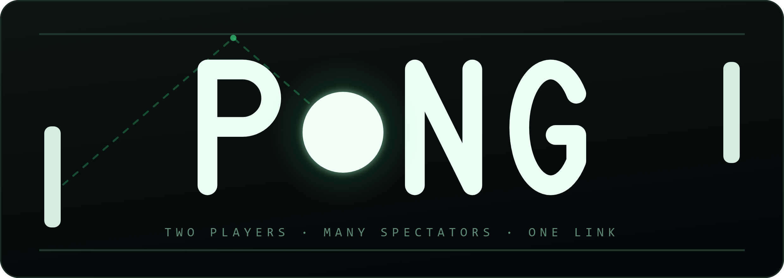
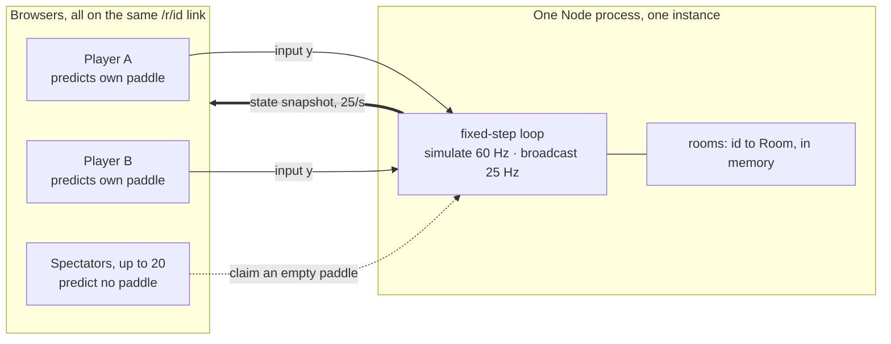
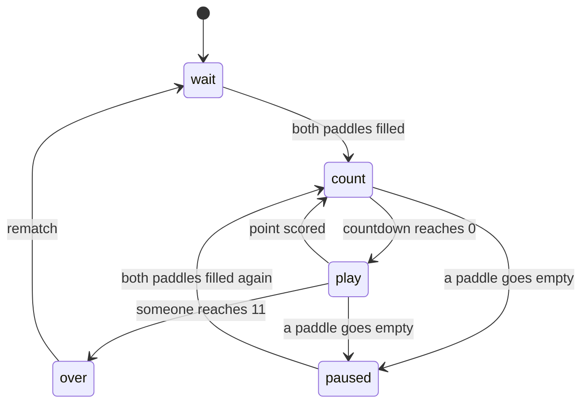
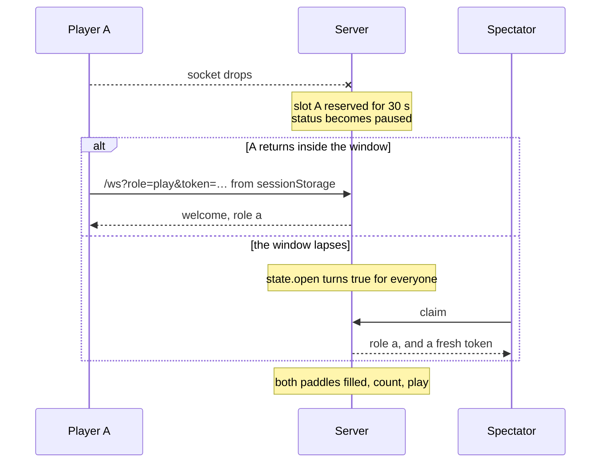
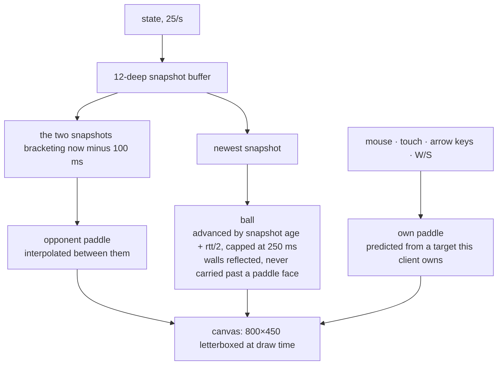
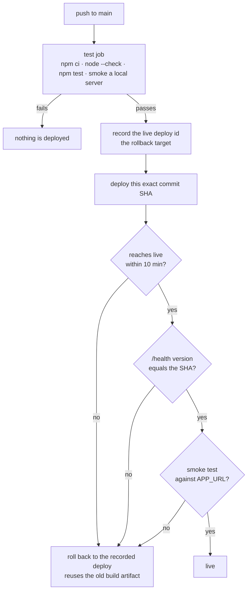

<p align="center">
  
</p>

<p align="center">
  <a href="https://github.com/assokhi/tetris/actions/workflows/deploy.yml"></a>
  
  
  <a href="LICENSE"></a>
</p>

# Pong — two players, many spectators

Server-authoritative Pong over WebSockets. The server owns the ball, the paddles
and the score, simulates at a fixed 60 Hz in an 800×450 virtual space, and
broadcasts snapshots at 25 Hz. Clients send a target paddle y and render an
interpolated view of what they receive.



| file | what is in it |
| --- | --- |
| [server.js](server.js) | HTTP, WebSocket, room registry, simulation, and the `--selftest` physics check |
| [client.html](client.html) | the entire client: canvas renderer, input, prediction, reconnect |
| [scripts/smoke.mjs](scripts/smoke.mjs) | end-to-end check against a running server |
| [render.yaml](render.yaml) · [deploy.yml](.github/workflows/deploy.yml) | host definition and the deploy-with-rollback pipeline |

## Run it

```
npm install          # one dependency: ws
npm start            # http://localhost:8080   (PORT=... to change)
npm test             # physics self-check: tunneling, angle reflection, walls, scoring
npm run smoke        # end-to-end against a running server (pass a base URL to target another host)
```

`npm run smoke` needs no environment setup and no waiting: it asks `POST /room`
for its own short reconnect and sweep windows, so every assertion — including
the spectator claim after a lapsed reservation, and the room sweep — runs
against any server, production included. `PONG_RESERVE_MS` and
`PONG_EMPTY_TTL_MS` only change the *defaults* for rooms that don't ask.

Open <http://localhost:8080>, click **Create room**, and share the `/r/<id>` URL.
Everyone uses the same link: the first two openers can choose **Play**, everyone
after that watches (up to 20) and can take over a paddle that goes empty.

Controls (players only): mouse, touch, arrow keys, or W/S.

## Rules and lifecycle

- First to 11. Either player can hit **Rematch**; the score resets and spectators stay.
- Serve is 1.5 s after each point, aimed away from whoever conceded.
- Paddle bounce is offset-based: where you hit the paddle sets the exit angle
  (up to 60°) and the ball speeds up 5% per hit, capped.

A room holds one status, and the second player arriving is what starts anything:



`over` is the one status a dropped player cannot interrupt: the game is decided,
so the server leaves it alone until someone asks for a rematch.

### When a player drops

Their slot is held for 30 s and the game pauses rather than ending. Whichever
comes first — the original player returning with their token, or the window
lapsing and a spectator claiming the seat — play resumes as soon as both paddles
are occupied again.



- Rooms are in-memory, swept every 5 s: dropped once everyone who was in them has
  left, or after 10 minutes with no player in either slot. A room with spectators
  but no player survives until that second timeout.
- A room nobody has connected to yet is exempt from the first rule for 60 s. Its
  creator's browser is still loading `/r/<id>`, and on a slow connection that
  outlasts a sweep tick — sweeping it there hands them a dead link to the room
  they just made.
- Both windows are per room: `POST /room` may shorten them (see below), which is
  how the smoke test covers the claim and sweep paths in seconds instead of
  minutes. This is deliberately unauthenticated — the worst anyone can do is make
  their *own* room forget them faster.

## HTTP

| Method | Path | Response |
| --- | --- | --- |
| `POST` | `/room` | `{id, reserveMs, emptyMs}`, room created. Optional JSON body `{reserveMs, emptyMs}` overrides that room's disconnect reservation (500 ms – 60 s) and no-player TTL (1 s – 10 min); out-of-range and junk values fall back to the defaults, and the body is capped at 1 KB. The response echoes the values actually used |
| `GET` | `/health` | `{ok, version, rooms, uptime}` — `version` is `RENDER_GIT_COMMIT` or `dev`. CI polls it to confirm the new process is serving traffic before smoke-testing it |
| `GET` | `/` | landing page (create / join by id) |
| `GET` | `/r/:id` | the same `client.html` |
| `GET` | `/ws?room=<id>&role=play\|watch&token=<t>` | WebSocket upgrade; `token` is optional and only used to reclaim a reserved slot |

## Message protocol

All frames are JSON with a `type` field.

### Client → server

| type | payload | who may send | server behaviour |
| --- | --- | --- | --- |
| `input` | `{y: number, ack?: number}` — target paddle y in virtual units, and the `t` of the newest snapshot this client had | player A or B only | `y` is clamped to `[40, 410]` and **ignored** unless the room's own record says this socket holds that slot. A claimed role in a message is never trusted. `ack` feeds the lag estimate. Send at ≤ 60/s. |
| `claim` | `{}` | any socket without a slot | seats it in a free, unreserved slot and replies with `role`; ignored if no slot is claimable |
| `rematch` | `{}` | player A or B only | only while `status === "over"`: resets the score, keeps the room and its spectators |

Malformed JSON, unknown types, and non-finite `y` are dropped silently.

### Server → client

| type | payload | sent to |
| --- | --- | --- |
| `welcome` | `{room, role: "a"\|"b"\|null, token: string\|null, dims:{W,H,R,PW,PH,AX,BX,SPEED,WIN}}` | once on connect. `role: null` means spectator; `token` reclaims the slot within the 30 s reservation |
| `state` | `{ball:{x,y,vx,vy}, paddles:{a,b}, score:{a,b}, spectators:int, open:bool, status, cd, winner, t}` | everyone in the room, 25 Hz, serialized once per room per tick |
| `role` | `{role:"a"\|"b", token}` | the socket whose `claim` succeeded; it switches to player mode |
| `lag` | `{ms}` — smoothed round trip plus snapshot age, capped at 250 ms | a player, at most every 2 s, in reply to an `input` carrying `ack` |
| `bye` | `{code, reason}` | any socket the server is about to close, sent ~250 ms before the close frame. Proxies (Render's included) may swallow a close frame and leave the peer with a bare `1006` and no reason, so the reason travels as ordinary data and the close code is only a fallback. Clients and the smoke test key off this message |

`status` is one of `wait` (no second player yet), `count` (serving, `cd` seconds
left), `play`, `paused` (a player dropped), `over` (`winner` is `"a"`/`"b"`).
`open` is true when a paddle is free *and* out of its reservation window — the
client uses it for both the Play/Watch choice and the "take the empty paddle"
button. `t` is the server's send time.

### Close codes

| code | reason |
| --- | --- |
| `4001` | `both paddles are taken` — the client reconnects as a spectator |
| `4002` | `spectator limit reached` (cap 20) |
| `4003` | `room closed` (TTL sweep) |
| `4004` | `server restarting` (SIGTERM) — the client says so instead of showing a generic disconnect |

Each of these arrives first as a `bye` message and then as the close code. Do not
depend on the close code alone: a proxy that drops the close frame turns every one
of them into `1006`, and a client reading only the code would treat "room full" as
a network blip and retry in a loop.

## Client rendering

Nothing is drawn from a raw snapshot position, and not everything is drawn from
the same moment in time.



**Paddles run 100 ms late.** They are interpolated between the two buffered
snapshots that bracket that moment, which is what keeps an opponent's motion
smooth across a lossy link.

**The ball does not.** Between bounces it travels in a straight line, so where it
is *now* follows exactly from the newest snapshot. Drawing it in the past let the
server award a point while the ball still looked a tenth of the field short of
the paddle — the player saw a shot they could still reach, and lost it anyway. So
it is advanced from the newest snapshot by that snapshot's age plus half the
round trip, capped at 250 ms, and reflected off the top and bottom walls, which
are predictable. Contact with a paddle is not predictable and is the server's
call, so the extrapolated ball is never carried past a paddle face the server has
not yet ruled on.

That offset has to be measured. Each `input` echoes the `t` of the newest
snapshot the client had; the server subtracts it from its own clock, smooths the
result and caps it at 250 ms — the number is client-influenced, so it is bounded
— and sends it back as `lag` at most twice a second. A spectator sends no input
and so has no measured round trip; it advances the ball by the snapshot's age
alone.

**A player's own paddle is predicted locally and never corrected mid-motion.** A
snapshot describes the paddle as it was a round trip ago, so while the player is
gliding it, being ahead of the server by speed × latency is correct prediction,
not error — nudging the rendered paddle toward that stale sample is what makes a
glide stutter, badly enough to snap backwards ~70 units per snapshot at 100 ms.
Position cannot be corrected here either: the paddle's position is a pure
function of a target this client owns, so the next frame's prediction pulls any
nudge straight back. So reconciliation instead waits until the paddle is settled
(target reached and unchanged for 150 ms) and, if the server is still working
from a different target — an input lost with a dying socket — re-sends the
target, at most twice a second, and lets the server's own simulation close the
gap.

### Reconnecting

An unexpected drop — the common case on mobile — reconnects automatically:
roughly 250 ms, 500 ms, 1 s, 2 s, 4 s, then capped at 5 s, each jittered ±20%,
for about 30 s, showing "reconnecting…" with the attempt count. A player reuses
the `sessionStorage` token and lands back in their own slot; a spectator just
rejoins. After 30 s it stops and offers a manual button.

Deliberate closes never enter that loop: `4001` falls straight back to watching,
`4002` and `4003` show the reason with a manual button, and `4004` says the
server is restarting and enables its button after 8 s, since the replacement
instance needs time to boot. Which case it is comes from the `bye` message when
there is one, falling back to the close code, so a proxy that eats close frames
cannot turn a deliberate refusal into a retry loop.

## Deployment

Host is Render's free tier, described by [render.yaml](render.yaml) and driven by
[.github/workflows/deploy.yml](.github/workflows/deploy.yml).

### One-time Render setup

1. Push this repo to GitHub.
2. In the Render dashboard: **New → Blueprint**, pick the repo, and apply. Render
   reads `render.yaml` and creates a single free-tier web service named `pong`
   in the Singapore region, building with `npm ci` and starting `node server.js`.
3. Leave auto-deploy off. `render.yaml` sets `autoDeploy: false` because a
   rollback through Render's API does *not* disable autodeploys — with it on, an
   autodeploy could restore the exact change CI just rolled back.

The service is deliberately pinned to one instance. Rooms live in an in-memory
`Map`, so a second instance would hold a different room registry with no way to
route a joiner to the right one. Never add autoscaling or raise `numInstances`.

### GitHub secrets

| Secret | Where to find it |
| --- | --- |
| `RENDER_API_KEY` | Render dashboard → your account menu → **Account Settings → API Keys → Create API Key**. Copy it once; it is not shown again. |
| `RENDER_SERVICE_ID` | The `srv-…` id in the service's dashboard URL (`dashboard.render.com/web/srv-…`), also shown under the service's **Settings**. |
| `APP_URL` | The service's public URL, e.g. `https://pong-xxxx.onrender.com`. **No trailing slash** — the workflow appends `/health`. |

### What the pipeline does



`test` runs on every push to `main` and every pull request: `npm ci`,
`node --check server.js`, `npm test`, then it starts the server on 8080, waits
for `/health`, and runs `scripts/smoke.mjs` against it — with no env overrides,
so it exercises exactly the path the live smoke does.

`deploy` runs only on a push to `main` that passed `test`:

1. Record the currently live deploy id — the rollback target. An empty result
   just means this is the first deploy.
2. Trigger a deploy of **this exact commit SHA**, not "latest on branch", so a
   push landing mid-run cannot ship untested code.
3. Poll the deploy until it reports `live`, failing fast on `build_failed`,
   `update_failed`, `pre_deploy_failed` or `canceled` (10 minute cap).
4. Poll `{APP_URL}/health` until `version` equals the pushed SHA. This is what
   proves the *new* process is serving traffic; without it the next step would
   smoke-test the old process and pass while proving nothing. On timeout the step
   reports which of three things it last saw, because they roll back for very
   different reasons: no response at all (service down or asleep),
   `version: "dev"` (`RENDER_GIT_COMMIT` is not populated, so the gate can never
   pass and the code is probably fine), or a different valid SHA (the old process
   is still serving — the rollout is slower than the poll window).
5. Run `scripts/smoke.mjs` against `APP_URL`. If it fails, the step prints
   `/health` next to the smoke output, so a failed assertion can be attributed to
   a stale process rather than to broken game logic.
6. If any of the above fails, roll back to the recorded deploy id. Rollback
   reuses the old build artifact rather than rebuilding, so recovery does not
   reintroduce build-time risk mid-incident. With no recorded id, the job says
   the broken version is live and exits 1.

The deploy job holds a `deploy-main` concurrency group with
`cancel-in-progress: false`: cancelling mid-rollout would leave the service in a
state the workflow cannot reason about.

### Two operational facts

- **Every deploy drops every game in progress.** The room registry is in memory
  and starts empty in the new process, so the 30 s reconnect reservation cannot
  help. On `SIGTERM` the server stops the simulation and closes every socket with
  code `4004`, so players see "server restarting — reconnect in a moment" rather
  than a generic disconnect.
- **A cold instance takes ~60 s to wake.** The free tier spins down after 15
  minutes with no inbound traffic. WebSocket messages from existing connections
  count as traffic, so an active game keeps the instance awake; only an idle
  server sleeps. The first request after that — including CI's health poll, which
  allows 90 s — pays the wake-up.

## License

[MIT](LICENSE)
